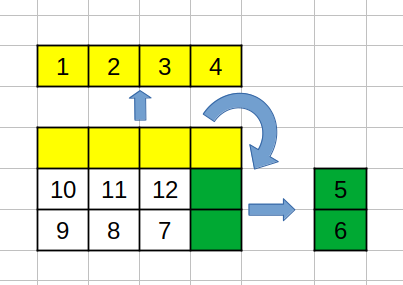
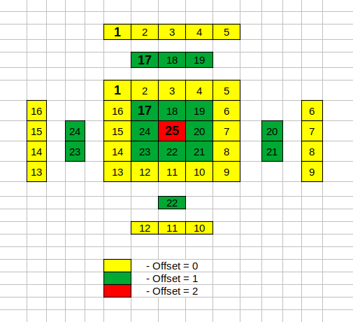

# Clockwise Matrics (python)

## Task

_Write a function that, given a matrix of integers, builds a list with the entries of that matrix appended in clockwise order._

```python
input = [[ 1,  2,  3, 4],
         [10, 11, 12, 5],
         [ 9,  8,  7, 6]]

clockwiseMatrix(input)
>>[1, 2, 3, 4, 5, 6, 7, 8, 9, 10, 11, 12]
```

---

### The function codes

- [test_matrix](https://github.com/antovk/test-tasks/blob/main/clockwise-matrix/test_matrix.py)
- [solution_1](https://github.com/antovk/test-tasks/blob/main/clockwise-matrix/clockwise_matrix_1.py)
- [solution_2](https://github.com/antovk/test-tasks/blob/main/clockwise-matrix/clockwise_matrix_2.py)

---

### Solution 1

First solution I`v desided to make as simple as possible.\
In this solution makes a deepcopy of the input argument and "cut" the side of the new matrix after each "rotation".



---

### Solution 2

In the second solution I consider source matrix as multiple matrices nested one each other with own offsets.\
At each cycle iteration get the values from the four sides of the matrix, after which offset is increased by 1.\
Initial position of each offset is top left corner (1, 17, 25)

- **y** - height of source matrix (number of rows)
- **x** - width of source matrix (number of columns)
- **offset** - matrix offset (outer matrix offset = 0, next offset = 1 etc.)


