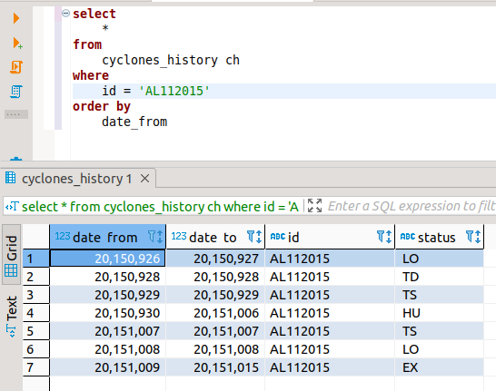

# Cyclones ETL

## Task

<pre>
Скрипты для задания необходимо выполнить на Python (v2 или v3) и SQL. 
Причём в большей мере надо стараться, чтобы логика была написана именно на SQL (в том числе без хранимых процедур и кода на plpgsql).  
В качестве СУБД использовать PostgreSQL.

1.
Загрузить любым способом CSV-файл из https://www.kaggle.com/noaa/hurricane-database#atlantic.csv в PostgreSQL БД в таблицу cyclones.
Это просто исходные данные для задания.

2.
Написать ETL-скрипт, который для указанного календарного месяца генерирует CSV-файлы с данными из cyclones.
Данные для каждого дня месяца должны быть в отдельном файле. Имена файлов сделать вида cyclones_20140128.csv

В каждом файле для каждого циклона (из тех для кого есть записи за заданный день) только одна строка с его последним статусом:
ID
date
status — последний статус

Для справки коды статусов:
TD – Tropical cyclone of tropical depression intensity (< 34 knots)
TS – Tropical cyclone of tropical storm intensity (34-63 knots)
HU – Tropical cyclone of hurricane intensity (> 64 knots)
EX – Extratropical cyclone (of any intensity)
SD – Subtropical cyclone of subtropical depression intensity (< 34 knots)
SS – Subtropical cyclone of subtropical storm intensity (> 34 knots)
LO – A low that is neither a tropical cyclone, a subtropical cyclone, nor an extratropical cyclone (of any intensity)
WV – Tropical Wave (of any intensity)
DB – Disturbance (of any intensity)

3.
Сгенерировать при помощи полученного в п.2 скрипта файлы для date >= 2013-01-01

4.
Написать второй ETL-скрипт, который будет уметь принимать один файл вида cyclones_20140128.csv и формировать историю статусов циклонов в таблице cyclones_history в PostgreSQL.

Колонки cyclones_history:
date_from
date_end
id
status
Принцип — значение status отличное от прежнего (а также отсутствие записи/статуса) означает начало нового периода (прежний период «закрывается» вчерашней датой).

Предполагается запуск скрипта для загрузки данных последовательно день за днем (в production просто каждый день).
Исходим и того, что не бывает повторной загрузки за какой-то предыдущий загруженный день.
Но надо учесть возможность повторной загрузки файла за последний день (данные в файле изменились).
То есть при загрузке повторно данных за последний день история статусов циклонов должна быть перестроена так, будто бы предыдущей загрузки за этот день не было вовсе.

5.
Загрузить историю из файлов полученных в п.3

В качестве результатов для проверки задания необходимо предоставить скрипты реализованные в п.2 и в п.4,
а также детальная информация (команды, скрипты и пр.) выполнения п.3 и п:5.
</pre>

## solution
## [1.py](https://github.com/antovk/test-tasks/blob/main/cyclones/1.py)

```python
import psycopg2
import pandas as pd
from calendar import monthrange
from datetime import datetime
from dateutil.relativedelta import relativedelta

conn = psycopg2.connect(
    database="xxx",
    user='xxx',
    password='xxx',
    host='localhost',
    port='5432'
)


def get_data_by_period(date_from, date_to):
    cursor = conn.cursor()
    cursor.execute('''
    select
    	id,
    	"date",
    	status as last_status
    from
    	cyclones c1
    where
    	c1."date" between {0} and {1}
    	and not exists (
    	select
    		1
    	from
    		cyclones c2
    	where
    		c2.id = c1.id
    		and c2."date" = c1."date"
    		and c2."time" > c1."time")
    order by
    	c1.id,
    	c1."date" desc,
    	c1."time" desc'''.format(date_from, date_to))

    result = cursor.fetchall()
    cursor.close()
    return result


def save_data_by_month(year, month):
    date_from = datetime(year, month, 1).strftime('%Y%m%d')
    date_to = datetime(year, month, monthrange(
        year, month)[1]).strftime('%Y%m%d')

    df = pd.DataFrame(get_data_by_period(date_from, date_to))
    if (len(df.index) != 0):
        days = df[1].unique()
        for day in days:
            day_df = df[df[1] == day]
            day_df.to_csv('output/cyclones_' + str(day) + '.csv',
                          index=False, header=False)


def save_all_data(date_from):
    dt = datetime.strptime(date_from, '%Y-%m-%d')
    while (dt <= datetime.today()):
        save_data_by_month(dt.year, dt.month)
        dt += relativedelta(months=1)


save_all_data('2013-01-01')
```

## [2.py](https://github.com/antovk/test-tasks/blob/main/cyclones/2.py)

```python
from datetime import datetime, timedelta
from os import listdir
from os.path import isfile, join

import pandas as pd
import psycopg2

conn = psycopg2.connect(
    database="xxx",
    user='xxx',
    password='xxx',
    host='localhost',
    port='5432'
)


def clear_data_by_date(conn, date):
    prev_date = (date - timedelta(days=1)).strftime('%Y%m%d')
    cur_date = date.strftime('%Y%m%d')

    cursor = conn.cursor()

    try:
        cursor.execute('''
        delete from
        	cyclones_history ch
        where
        	ch.date_from = {0}
            and ch.date_to = {0}
        '''.format(cur_date))
        conn.commit()

        cursor.execute('''
        update
        	cyclones_history ch
        set ch.date_to = {0}
        where
            ch.date_to = {1}
        '''.format(prev_date, cur_date))
        conn.commit()

    except (Exception, psycopg2.DatabaseError):
        conn.rollback()
        cursor.close()
    cursor.close()


def insert_data_by_date(conn, date):

    prev_date = (date - timedelta(days=1)).strftime('%Y%m%d')
    cur_date = date.strftime('%Y%m%d')

    try:
        df = pd.read_csv('output/cyclones_' + cur_date +
                         '.csv', sep=',', header=None)
    except FileNotFoundError:
        return

    cursor = conn.cursor()

    for item in df.itertuples():
        try:
            cyclone_id = item[1]
            cyclone_status = item[3]

            cursor.execute('''
            insert into cyclones_history
            (date_from, date_to, id, status)
            select {3}, {3}, '{0}', '{1}'
            where
            	not exists (
                    select 1
                    from
                        cyclones_history ch_1
                    where
                        ch_1.id = '{0}'
                        and ch_1.status = '{1}'
                        and ch_1.date_to = {2})
            '''.format(cyclone_id, cyclone_status, prev_date, cur_date))
            conn.commit()
            cursor.execute('''
            update
            	cyclones_history
            set date_to = {3}
            where
                id = '{0}'
                and status = '{1}'
                and date_to = {2}
            '''.format(cyclone_id, cyclone_status, prev_date, cur_date))
            conn.commit()

        except (Exception, psycopg2.DatabaseError):
            conn.rollback()
            cursor.close()

    cursor.close()


def process_data():
    path = 'output/'
    input_files = [f for f in listdir(path) if isfile(join(path, f))]
    input_files.sort()
    for file in input_files:
        dt = datetime.strptime(file[9:17], '%Y%m%d')
        clear_data_by_date(conn, dt)
        insert_data_by_date(conn, dt)


process_data()
```
## Result
