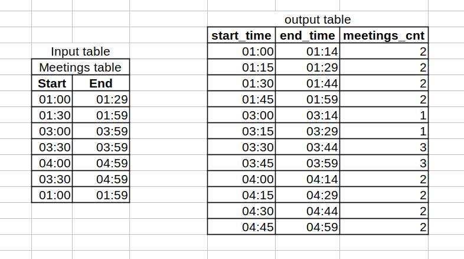

# another report transform (counting events by interval)

---

## Task

_Create a table of 15 min interval to show the numbers of meetings hapenning._\
_Below the example of input table and the expected result._



## [Spark solution (Lateral view explode)](https://github.com/antovk/test-tasks/blob/main/meetings-report/meetings_spark.sql)

```sql
WITH t1 AS
 (SELECT 1 AS meeting_id, '2022-07-01 01:00:00' AS start_time, '2022-07-01 01:29:00' AS end_time UNION ALL
  SELECT 2 AS meeting_id, '2022-07-01 01:30:00' AS start_time, '2022-07-01 01:59:00' AS end_time UNION ALL
  SELECT 3 AS meeting_id, '2022-07-01 03:00:00' AS start_time, '2022-07-01 03:59:00' AS end_time UNION ALL
  SELECT 4 AS meeting_id, '2022-07-01 03:30:00' AS start_time, '2022-07-01 03:59:00' AS end_time UNION ALL
  SELECT 5 AS meeting_id, '2022-07-01 04:00:00' AS start_time, '2022-07-01 04:59:00' AS end_time UNION ALL
  SELECT 6 AS meeting_id, '2022-07-01 03:30:00' AS start_time, '2022-07-01 04:59:00' AS end_time UNION ALL
  SELECT 7 AS meeting_id, '2022-07-01 01:00:00' AS start_time, '2022-07-01 01:59:00' AS end_time)

SELECT t3.start_time
     , t3.end_time
     , count(*) AS num_meetings
FROM (SELECT t2.meeting_id
           , from_unixtime(unix_timestamp(cast(t2.start_time AS timestamp)) + rn * 15 * 60)           AS start_time
           , from_unixtime(unix_timestamp(cast(t2.start_time AS timestamp)) + rn * 15 * 60 + 14 * 60) AS end_time
      FROM (SELECT t1.*, row_number() OVER (PARTITION BY meeting_id) - 1 AS rn
            FROM t1 LATERAL VIEW explode(
               split(
                    space(
                         cast((unix_timestamp(t1.end_time) - unix_timestamp(t1.start_time) + 60) / 60 / 15 AS int -- calculate number of 15-minute intervals
                         ) - 1 -- subtract 1 to account for the first interval
                    ), ' ') -- split to array of spaces
               ) f1 -- explode the array into a list of 15-minute intervals
          ) t2
     ) t3
GROUP BY t3.start_time
       , t3.end_time
ORDER BY t3.start_time
       , t3.end_time
```

## [PostgreSQL solution (Recursive CTE)](https://github.com/antovk/test-tasks/blob/main/meetings-report/meetings_pg.sql)

```sql
WITH RECURSIVE
t0 AS
 (SELECT 1 AS meeting_id, to_timestamp('2022-07-01 01:00:00', 'YYYY-MM-DD HH24:MI:SS') AS start_datetime, to_timestamp('2022-07-01 01:29:00', 'YYYY-MM-DD HH24:MI:SS') AS end_datetime UNION ALL
 SELECT 2, to_timestamp('2022-07-01 01:30:00', 'YYYY-MM-DD HH24:MI:SS'), to_timestamp('2022-07-01 01:59:00', 'YYYY-MM-DD HH24:MI:SS') UNION ALL
 SELECT 3, to_timestamp('2022-07-01 03:00:00', 'YYYY-MM-DD HH24:MI:SS'), to_timestamp('2022-07-01 03:59:00', 'YYYY-MM-DD HH24:MI:SS') UNION ALL
 SELECT 4, to_timestamp('2022-07-01 03:30:00', 'YYYY-MM-DD HH24:MI:SS'), to_timestamp('2022-07-01 03:59:00', 'YYYY-MM-DD HH24:MI:SS') UNION ALL
 SELECT 5, to_timestamp('2022-07-01 04:00:00', 'YYYY-MM-DD HH24:MI:SS'), to_timestamp('2022-07-01 04:59:00', 'YYYY-MM-DD HH24:MI:SS') UNION ALL
 SELECT 6, to_timestamp('2022-07-01 03:30:00', 'YYYY-MM-DD HH24:MI:SS'), to_timestamp('2022-07-01 04:59:00', 'YYYY-MM-DD HH24:MI:SS') UNION ALL
 SELECT 7, to_timestamp('2022-07-01 01:00:00', 'YYYY-MM-DD HH24:MI:SS'), to_timestamp('2022-07-01 01:59:00', 'YYYY-MM-DD HH24:MI:SS'))
,
t1 AS (SELECT m1.meeting_id
            , m1.start_datetime
            , m1.start_datetime + INTERVAL '14 minutes' AS period_end_time
            , m1.end_datetime
       FROM t0 m1
       UNION ALL
       SELECT t1.meeting_id
            , t1.period_end_time + INTERVAL '1 minute'
            , t1.period_end_time + INTERVAL '15 minutes'
            , t1.end_datetime
       FROM t1
       WHERE t1.period_end_time < t1.end_datetime)

SELECT to_char(start_datetime, 'hh24:mi') as start_time
     , to_char(period_end_time, 'hh24:mi') as end_time
     , count(*) as num_meetings
FROM t1
GROUP BY t1.start_datetime
       , t1.period_end_time
ORDER BY t1.start_datetime
       , t1.period_end_time;
```
