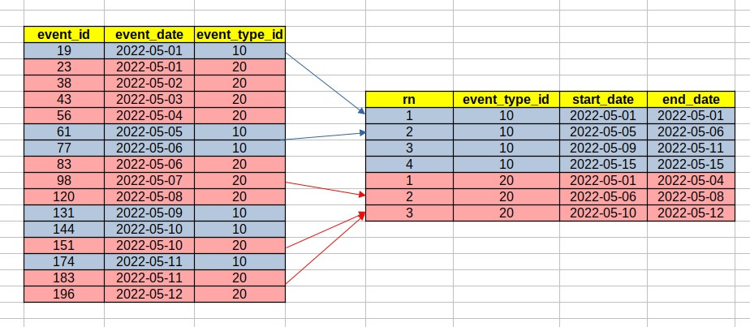

# report transform (grouping by periods)

## Task

_Transform this report - aggregate events by event_type_id and periods as in the example:_\
_The result table mast include the fields: row_number, event_type_id, start_period_date, end_period_date_



---

## [create table and insert](https://github.com/antovk/test-tasks/blob/main/report-transform/create_and_insert.sql)

```sql
CREATE TABLE events
(
    event_id      integer,
    event_date    date,
    event_type_id integer
);

insert into events (event_id, event_date, event_type_id)
values (19, '2022-05-01', 10)
     , (23, '2022-05-01', 20)
     , (38, '2022-05-02', 20)
     , (43, '2022-05-03', 20)
     , (56, '2022-05-04', 20)
     , (61, '2022-05-05', 10)
     , (77, '2022-05-06', 10)
     , (83, '2022-05-06', 20)
     , (98, '2022-05-07', 20)
     , (120, '2022-05-08', 20)
     , (131, '2022-05-09', 10)
     , (144, '2022-05-10', 10)
     , (151, '2022-05-10', 20)
     , (174, '2022-05-11', 10)
     , (183, '2022-05-11', 20)
     , (196, '2022-05-12', 20)
     , (211, '2022-05-15', 10)
;
```

## [solution](https://github.com/antovk/test-tasks/blob/main/report-transform/report_transform.sql)

```sql
SELECT
       row_number() OVER (PARTITION BY event_type_id ORDER BY event_date)                             AS rn
     , event_type_id                                                                                  AS evt_type_id
     , event_date                                                                                     AS start_date
     , lead(t1.lag_evt_date, 1, max_event_date) OVER (PARTITION BY event_type_id ORDER BY event_date) AS end_date

FROM
     (SELECT
             event_type_id
           , ev.event_date
           , lag(event_date, 1, event_date) OVER (PARTITION BY event_type_id ORDER BY event_date) AS lag_evt_date
           , max(event_date) OVER (PARTITION BY event_type_id)                                    AS max_event_date
      FROM
          events ev) t1

WHERE
     t1.event_date - 1 != t1.lag_evt_date

ORDER BY
         t1.event_type_id
       , t1.event_date;
```
